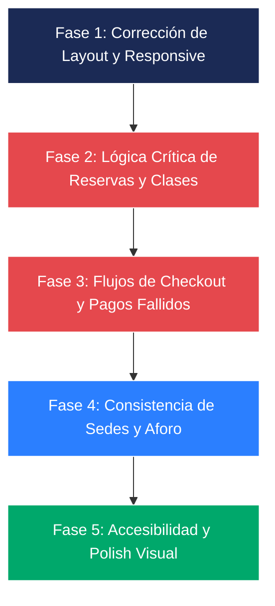

# FitZone Sports — Documento Maestro de Testing, Hallazgos y Registro de Cambios

> **Última actualización:** Octubre 2026  
> **Alcance:** Auditoría integral y seguimiento de desarrollo (Módulos 1 a 5: Socio Activo, Socio Vencido, Cliente Externo, Recepción, Gerente Central, Checkout/AFIP, Canchas, Clases y Aforo).  
> **Estado de compilación:** 🟢 **Vite Build Exitoso** (0 errores, 0 warnings en producción).  
> **Propósito:** Consolidar en una única fuente de verdad el estado técnico del sistema, estructurando el backlog priorizado de errores por resolver y el registro cronológico de refactorizaciones ya implementadas.

---

## 📑 Índice General

1. [Resumen Ejecutivo y Métricas](#1-resumen-ejecutivo-y-métricas)
2. [Matriz de Control y Estado de Hallazgos](#2-matriz-de-control-y-estado-de-hallazgos)
3. [Backlog de Hallazgos Pendientes](#3-backlog-de-hallazgos-pendientes)
   - [3.1 Errores Críticos y Funcionales (Severidad Alta)](#31-errores-críticos-y-funcionales-severidad-alta)
   - [3.2 Errores de Severidad Media y Lógica de Negocio](#32-errores-de-severidad-media-y-lógica-de-negocio)
   - [3.3 Discrepancias con Requerimientos y Diseños de Figma](#33-discrepancias-con-requerimientos-y-diseños-de-figma)
   - [3.4 Inconsistencias de Estado Global y Persistencia](#34-inconsistencias-de-estado-global-y-persistencia)
   - [3.5 Oportunidades de Calidad de Vida (QOL) y Accesibilidad](#35-oportunidades-de-calidad-de-vida-qol-y-accesibilidad)
4. [Registro de Mejoras y Refactorizaciones Implementadas (Changelog)](#4-registro-de-mejoras-y-refactorizaciones-implementadas-changelog)
   - [4.1 Ajustes Generales y Lógica de Negocio](#41-ajustes-generales-y-lógica-de-negocio)
   - [4.2 Experiencia Responsive y Navegación Móvil](#42-experiencia-responsive-y-navegación-móvil)
   - [4.3 Consistencia Visual y Sistema de Diseño](#43-consistencia-visual-y-sistema-de-diseño)
5. [Hoja de Ruta y Próximos Pasos Recomendados](#5-hoja-de-ruta-y-próximos-pasos-recomendados)

---

## 1. Resumen Ejecutivo y Métricas

Se ejecutó una auditoría técnica profunda sobre el código fuente, la arquitectura de componentes (`React 18 + Vite`), el estado global (`AppContext.jsx`), la responsividad en Tailwind CSS y la correspondencia con los prototipos de Figma (`temp_figma/` y `screens_summary.json`).

El proyecto se encuentra en una fase funcional avanzada con base visual sólida. No obstante, conviven funcionalidades recientemente optimizadas (como la botonera inferior móvil, la vista "Más", y el cálculo dinámico de precios con descuentos) con **bugs funcionales pendientes** en flujos de reserva, sobreventa de canchas, pagos rechazados y sincronización de datos entre sedes.

```
+-------------------------------------------------------------+
|                     ESTADO DE HALLAZGOS                     |
+-------------------------------------------------------------+
|  🔴 Severidad Alta (Críticos):       6 pendientes           |
|  🟡 Severidad Media:                 7 pendientes           |
|  🟢 Severidad Baja / QOL:            6 pendientes           |
|  ✅ Resueltos / Refactorizados:     19 implementaciones     |
+-------------------------------------------------------------+
```

---

## 2. Matriz de Control y Estado de Hallazgos

| ID | Módulo | Severidad | Estado | Descripción Resumida | Archivo Principal |
|:---|:---|:---:|:---:|:---|:---|
| **BUG-01** | Layout / Mobile | 🔴 Alta | ⏳ Pendiente | Menú hamburguesa móvil no despliega drawer o menú | `src/components/layout/Navbar.jsx` |
| **BUG-02** | Clases Grupales | 🔴 Alta | ⏳ Pendiente | Permite confirmar reserva en clases en estado CANCELADA | `src/pages/socio/SocioClassDetailPage.jsx` |
| **BUG-03** | Facturación / Checkout | 🔴 Alta | ⏳ Pendiente | Reintentar pago fallido cobra membresía ($15.000) en vez de cancha | `src/pages/checkout/CheckoutPage.jsx` |
| **BUG-04** | Canchas / Reservas | 🔴 Alta | ⏳ Pendiente | Turno pagado no actualiza el slot a OCUPADO en la grilla global | `src/context/AppContext.jsx` |
| **BUG-05** | Canchas / Grilla | 🔴 Alta | ⏳ Pendiente | Cambiar de deporte retiene el id y precio del deporte anterior | `src/pages/socio/SocioCourtsGridPage.jsx` |
| **RESP-01** | Mobile / Layout | 🔴 Alta | ⏳ Pendiente | Barra `BottomNav` cubre botones primarios al pie de página | `src/App.jsx` |
| **BUG-06** | Canchas / Grilla | 🟡 Media | ⏳ Pendiente | Cancha 2 de Paddle inaccesible (siempre toma Cancha 1) | `src/pages/socio/SocioCourtsGridPage.jsx` |
| **BUG-07** | Recepción / Caja | 🟡 Media | ⏳ Pendiente | Cobro en efectivo siempre asigna el pago a Martín García | `src/pages/recepcion/RecepcionCashRegisterPage.jsx` |
| **BUG-08** | Recepción / Canchas | 🟡 Media | ⏳ Pendiente | Modal de mantenimiento no valida fechas ingresadas manualmente | `src/pages/recepcion/RecepcionCourtsManagementPage.jsx` |
| **BUG-09** | Recepción / Aforo | 🟡 Media | ⏳ Pendiente | Aforo solo computa ingresos para Palermo y no admite egresos | `src/context/AppContext.jsx` |
| **RESP-03** | Facturación / Voucher | 🟡 Media | ⏳ Pendiente | Impresión de comprobante imprime barras de navegación y menús | `src/pages/checkout/VoucherPage.jsx` |
| **RESP-04** | Sidebar / Desktop | 🟡 Media | ⏳ Pendiente | Badge de aforo (86%) en menú lateral no responde a la sede activa | `src/components/layout/Sidebar.jsx` |
| **DATA-01** | Sedes / Catálogo | 🟡 Media | ⏳ Pendiente | Grilla de canchas y agenda de clases solo tienen datos de Palermo | `src/context/AppContext.jsx` |
| **FIG-01** | Canchas / Grilla | 🟡 Media | ⏳ Pendiente | Vista de turnos compacta en 6 columnas difiere de la lista de Figma | `src/pages/socio/SocioCourtsGridPage.jsx` |
| **FIG-02** | Clases / Espera | 🟢 Baja | ⏳ Pendiente | Posición `#3` y fecha en lista de espera fijas en el JSX | `src/pages/socio/SocioWaitlistPage.jsx` |
| **FIG-03** | Canchas / Grilla | 🟢 Baja | ⏳ Pendiente | Cambiar de día en la grilla no altera los turnos ocupados | `src/pages/socio/SocioCourtsGridPage.jsx` |
| **FIG-04** | Recepción / Canchas | 🟢 Baja | ⏳ Pendiente | `addCourt` crea únicamente 3 franjas en vez de las 6 estándar | `src/context/AppContext.jsx` |
| **DATA-02** | Estado Global | 🟢 Baja | ⏳ Pendiente | Pérdida de estado al recargar con F5 (sin persistencia en localStorage) | `src/context/AppContext.jsx` |
| **DATA-03** | Datos / Consistencia | 🟢 Baja | ⏳ Pendiente | Fechas mixtas hardcodeadas producen días inconsistentes | Múltiples componentes |
| **DATA-04** | Sesión / Auth | 🟢 Baja | ⏳ Pendiente | Cerrar sesión navega a login sin reiniciar el estado en memoria | `src/context/AppContext.jsx` |
| **FIG-05** | Gerencia / Reportes | 🟡 Media | ✅ Resuelto | Implementadas rutas y subpaneles individuales para Gerencia | `src/pages/gerente/GerenteDashboardPage.jsx` |
| **RESP-02** | Layout / TopBar | 🟡 Media | ✅ Mitigado | Barra superior despejada y libre de sobrecarga visual | `src/components/layout/RoleSwitcher.jsx` |

---

## 3. Backlog de Hallazgos Pendientes

### 3.1 Errores Críticos y Funcionales (Severidad Alta)

#### 🔴 BUG-01: El botón de menú móvil (Hamburguesa) no despliega ningún menú
- **Ubicación:** `src/components/layout/Navbar.jsx` (Líneas 201–208) y `src/App.jsx`.
- **Comportamiento actual:** Al hacer clic en el botón de hamburguesa en pantallas pequeñas (`< 1024px`), el estado booleano `isMobileMenuOpen` se invierte y el icono alterna entre `Menu` y `X`, pero ningún componente de navegación o sidebar móvil es renderizado en pantalla.
- **Impacto:** En dispositivos móviles, los usuarios no cuentan con un menú lateral desplegable para acceder a rutas que no están en la barra inferior.
- **Solución propuesta:** Integrar un componente Drawer / Modal lateral en `Navbar.jsx` o en `App.jsx` condicionado a `isMobileMenuOpen`, mostrando los accesos principales de navegación según el rol activo.

---

#### 🔴 BUG-02: Se permite reservar clases grupales con estado "CANCELADA"
- **Ubicación:** `src/pages/socio/SocioClassDetailPage.jsx` (Líneas 167–182).
- **Comportamiento actual:** Al abrir el detalle de una clase suspendida por la administración (ej. *Yoga* `cls-3`, cuyo cupo es 0/14 por licencia médica), la expresión `freeSpots` evalúa a 14 lugares libres. La condición de la vista evalúa únicamente `freeSpots <= 0` para enviar a lista de espera; en consecuencia, muestra habilitado el botón verde **"Confirmar Reserva de Clase"**.
- **Impacto:** Se pueden emitir reservas confirmadas sobre actividades dadas de baja.
- **Solución propuesta:** Agregar una validación preliminar sobre el estado de la clase:
  ```javascript
  if (selectedClass.status === 'CANCELADA') {
    // Deshabilitar botón, mostrar alerta informativa en rojo y bloquear acción
  }
  ```

---

#### 🔴 BUG-03: Reintentar un pago rechazado desde el historial redirige a un cobro genérico erróneo
- **Ubicación:** `src/pages/socio/SocioHistoryPage.jsx` (Línea 158) y `src/pages/checkout/CheckoutPage.jsx` (Líneas 21–25).
- **Comportamiento actual:** En la tabla de historial de pagos, al presionar "Reintentar pago" sobre la transacción rechazada (`FZ-P84102`, reserva de cancha por $8.000), se ejecuta `navigate('checkout', { payment: p })`. Sin embargo, `CheckoutPage` únicamente inspecciona `routeParams?.booking` y `routeParams?.concept`, ignorando `routeParams?.payment`.
- **Impacto:** La pantalla de checkout cae en el fallback por defecto y le cobra al usuario **$15.000 de Membresía mensual** en lugar de reintentar la reserva de cancha rechazada por $8.000.
- **Solución propuesta:** En `CheckoutPage.jsx`, verificar si viene `routeParams?.payment` para reconstruir los conceptos, monto exacto y descripción original del pago a reintentar.

---

#### 🔴 BUG-04: La reserva pagada no actualiza la disponibilidad del turno en la grilla de canchas
- **Ubicación:** `src/context/AppContext.jsx` (`processPayment`, Líneas 702–750) y `src/pages/socio/SocioCourtsGridPage.jsx`.
- **Comportamiento actual:** Cuando se completa un pago de cancha con éxito, se crea el registro en `courtBookings` con estado `CONFIRMADA`. Sin embargo, el slot correspondiente dentro del array global de canchas (`courts`) permanece con estado `'DISPONIBLE'`.
- **Impacto:** Si el usuario regresa a la grilla de turnos, la franja horaria recién abonada continúa mostrándose como disponible y permite que otro usuario la reserve (sobreventa de turnos).
- **Solución propuesta:** Dentro de `processPayment`, al confirmar una reserva de tipo cancha, mapear la lista de `courts` y cambiar el estado del slot correspondiente a `'OCUPADO'`.

---

#### 🔴 BUG-05: Estado de turno desincronizado al cambiar de deporte en la grilla
- **Ubicación:** `src/pages/socio/SocioCourtsGridPage.jsx` (Líneas 21–27 y 32).
- **Comportamiento actual:** El estado `selectedSlot` se inicializa con el slot `'s-19'` de Paddle Cancha 1 a $10.200 / $12.000. Si el usuario conmuta de deporte (por ejemplo, a "Fútbol 5", tarifa base $16.000), `selectedSlot` retiene el id y precio de la cancha anterior hasta que el usuario hace clic manualmente en un nuevo horario.
- **Impacto:** El panel inferior "TU SELECCIÓN" muestra una combinación inconsistente (título de Fútbol 5 pero horario y tarifa de Paddle).
- **Solución propuesta:** Incorporar un `useEffect` que resetee `selectedSlot` o seleccione el primer turno libre del nuevo deporte cada vez que `selectedSport` cambie.

---

#### 🔴 RESP-01: Elementos inferiores tapados por la barra `BottomNav` en dispositivos móviles
- **Ubicación:** `src/App.jsx` (Línea 183) y `src/components/layout/BottomNav.jsx`.
- **Comportamiento actual:** `BottomNav` es una barra fija (`fixed bottom-0 z-40`). El contenedor `<main>` posee `p-4 sm:p-6 lg:p-8`, pero **carece de `pb-20` o `pb-24` en resoluciones móviles**.
- **Impacto:** Botones primarios situados al fondo de las pantallas (como "Continuar con este turno", "Confirmar pago", "Guardar asistencia" o "Salir de lista de espera") quedan ocultos o superpuestos debajo de la barra inferior.
- **Solución propuesta:** Añadir `pb-24 lg:pb-8` a la etiqueta `<main>` en `App.jsx`.

---

### 3.2 Errores de Severidad Media y Lógica de Negocio

#### 🟡 BUG-06: Múltiples canchas del mismo deporte son inaccesibles en la grilla de socios
- **Ubicación:** `src/pages/socio/SocioCourtsGridPage.jsx` (Línea 32).
- **Comportamiento actual:** La vista resuelve la cancha activa mediante:
  ```javascript
  const currentCourt = courts.find(c => c.sport === selectedSport) || courts[0];
  ```
  Al existir dos canchas de Paddle (*Paddle · Cancha 1* y *Paddle · Cancha 2*), la búsqueda siempre devuelve la primera.
- **Impacto:** El socio nunca puede consultar ni reservar los horarios de Cancha 2.
- **Solución propuesta:** Añadir un selector de pista/cancha dentro del deporte seleccionado cuando existan múltiples canchas disponibles.

---

#### 🟡 BUG-07: El registro de cobro en efectivo en recepción siempre asigna el pago a Martín García
- **Ubicación:** `src/pages/recepcion/RecepcionCashRegisterPage.jsx` (Líneas 19–25 y 90–115).
- **Comportamiento actual:** El estado `selectedUser` se encuentra hardcodeado con los datos del socio demo "Martín García". Escribir en el campo de búsqueda por DNI/nombre no filtra ni actualiza el usuario seleccionado.
- **Impacto:** Cualquier cobro registrado en efectivo se emite y factura siempre a nombre de Martín García.
- **Solución propuesta:** Vincular el campo de búsqueda con el listado de usuarios del contexto o desplegar sugerencias interactivas para elegir al socio pagador.

---

#### 🟡 BUG-08: El bloqueo por mantenimiento en recepción no permite corregir fechas manualmente
- **Ubicación:** `src/pages/recepcion/RecepcionCourtsManagementPage.jsx` (Líneas 40–45 y 316–364).
- **Comportamiento actual:** Al abrir el modal de mantenimiento, `hasOverlapError` se fuerza a `true` para simular la colisión de horarios. No existe validación en tiempo real que verifique si los horarios tipeados manualmente quedan libres; el botón "Guardar mantenimiento" se bloquea a menos que se use el botón de sugerencia automática.
- **Impacto:** Imposibilidad de configurar mantenimientos manuales personalizados.
- **Solución propuesta:** Implementar una función de validación contra las reservas existentes que recalcule `hasOverlapError` dinámicamente según las fechas ingresadas en los inputs.

---

#### 🟡 BUG-09: El aforo de recepción solo suma a "Palermo" y no admite egresos
- **Ubicación:** `src/context/AppContext.jsx` (`logAccessScan`, Líneas 792–815).
- **Comportamiento actual:** Al escanear un QR válido, la función incrementa la ocupación únicamente si `s.name.includes('Palermo')`, ignorando la sede en la que se encuentra el recepcionista. Además, no existe flujo de egreso de personas.
- **Impacto:** Las demás sedes nunca reflejan actividad y el aforo no decrece a lo largo de la jornada.
- **Solución propuesta:** Parametrizar la actualización de aforo con la sede actual (`selectedSede.id`) y añadir soporte para operaciones de `TIPO: 'INGRESO'` y `'EGRESO'`.

---

#### 🟡 RESP-03: Impresión de comprobante (Voucher / Factura AFIP) imprime toda la interfaz web
- **Ubicación:** `src/pages/checkout/VoucherPage.jsx` y `src/index.css`.
- **Comportamiento actual:** El botón "Descargar PDF" ejecuta `window.print()`. Sin embargo, `Navbar`, `Sidebar`, `RoleSwitcher` y `BottomNav` no poseen utilidades de ocultamiento en impresión.
- **Impacto:** El comprobante impreso incluye menús, barras de herramientas y botones de navegación.
- **Solución propuesta:** Aplicar la clase `print:hidden` a los componentes de layout (`Navbar`, `Sidebar`, `RoleSwitcher`, `BottomNav`) y definir estilos limpios en `@media print` para el comprobante.

---

#### 🟡 RESP-04: Indicador de aforo estático en el Sidebar
- **Ubicación:** `src/components/layout/Sidebar.jsx` (Línea 55).
- **Comportamiento actual:** El enlace a "Control de Aforo" posee un badge fijo con el texto `86%`.
- **Impacto:** Al cambiar a una sede con distinta ocupación (ej. 45% o 92%), el badge no refleja el dato real.
- **Solución propuesta:** Conectar el badge al porcentaje de ocupación de la sede activa:
  ```javascript
  const currentCapacity = Math.round((currentSede.currentOccupancy / currentSede.capacity) * 100);
  ```

---

#### 🟡 DATA-01: El catálogo de canchas y clases no responde a la sede seleccionada
- **Ubicación:** `src/context/AppContext.jsx`.
- **Comportamiento actual:** Aunque el usuario cambie la sede activa a "Sede Belgrano", "Sede Córdoba" o "Sede Rosario", la grilla de canchas y la agenda de clases continúan listando exclusivamente la oferta de "Sede Palermo".
- **Impacto:** Falta de catálogo multisede funcional en las pantallas de socios y externos.
- **Solución propuesta:** Asociar las entidades `courts` y `classes` a un `sedeId`, filtrando las listas según `selectedSede.id`.

---

### 3.3 Discrepancias con Requerimientos y Diseños de Figma

#### 📐 FIG-01: Grilla de turnos de canchas difiere del diseño original de Figma
- **En Figma (`grilla_canchas_socio.html` / `grilla_canchas_externo.html`):** Los turnos se presentan como una lista vertical de franjas horarias con tarjeta ancha (Horario, Tipo de Tarifa, Badge de Estado, Precio Calculado destacado y botón interactivo "Elegir turno" / "Seleccionado" / "No disponible"). A la derecha se sitúa un panel fijo "TU SELECCIÓN".
- **En la implementación:** Se presenta como una matriz de cuadrícula de 6 columnas horizontales compactas con botones inferiores condensados, perdiendo legibilidad en pantallas intermedias.
- **Acción recomendada:** Adaptar la visualización a tarjetas verticales apiladas o permitir alternancia entre vista de lista (Figma) y vista matricial compacta.

---

#### 📐 FIG-02: Posición en lista de espera hardcodeada
- **En Figma (`socio_lista_espera.html`):** La tarjeta de lista de espera muestra la posición calculada dinámicamente, cantidad de personas por delante y fecha exacta de suscripción.
- **En la implementación (`SocioWaitlistPage.jsx`):** La posición `#3`, el texto "2 personas antes que vos" y la fecha "28 Sep · 09:30" son strings fijos en el JSX. Cualquier socio que ingrese a lista de espera ve siempre la misma tarjeta fija.
- **Acción recomendada:** Vincular los datos de la lista de espera al array de espera del contexto (`waitlist`) para calcular la posición real del socio.

---

#### 📐 FIG-03: Las franjas horarias no varían según el día seleccionado
- **En Figma:** Seleccionar distintas fechas refleja diferentes niveles de ocupación.
- **En la implementación:** Al alternar días en la grilla de canchas, únicamente cambia el string de la fecha en la cabecera; los turnos y sus estados ocupado/disponible son idénticos para todos los días.
- **Acción recomendada:** Indexar los estados de los slots por fecha (`YYYY-MM-DD`).

---

#### 📐 FIG-04: Al crear una cancha en recepción se omiten franjas horarias estándar
- **En Figma (`recepcion_canchas.html`):** Las canchas operan con 6 franjas diarias (16:00 a 22:00 hs).
- **En la implementación (`AppContext.jsx`, línea 840):** La función `addCourt` solo crea 3 franjas fijas (`16:00–17:00`, `17:00–18:00` y `19:00–20:00`), dejando fuera los horarios de 18:00, 20:00 y 21:00.
- **Acción recomendada:** Generar el set completo de 6 franjas por defecto al dar de alta una nueva pista deportiva.

---

### 3.4 Inconsistencias de Estado Global y Persistencia

#### 💾 DATA-02: Falta de persistencia en recarga de página (F5)
- **Descripción:** Todo el estado del sistema (`sedes`, `classes`, `courts`, `courtBookings`, `payments`, `accessLogs`) vive en memoria dentro de hooks `useState` en `AppContext.jsx`.
- **Impacto:** Si el usuario recarga la página, todas las reservas, cobros y modificaciones realizadas durante la sesión de prueba se reinician a los valores semilla.
- **Acción recomendada:** Incorporar sincronización opcional con `localStorage` para preservar las mutaciones clave durante la navegación y testing.

---

#### 💾 DATA-03: Fechas estáticas y desfasadas
- **Descripción:** Coexisten cadenas de texto de fechas con valores hardcodeados dispares (ej. "Jueves 1 de octubre de 2026", "Lunes 28 de septiembre de 2026", "Viernes 2 de octubre de 2026").
- **Impacto:** En una misma pantalla pueden convivir actividades marcadas como "Hoy" en días de la semana diferentes.
- **Acción recomendada:** Centralizar una fecha base simulada o utilizar la fecha del sistema (`new Date()`) de forma uniforme mediante utilidades de formateo.

---

#### 💾 DATA-04: Cierre de sesión no reinicia el estado de usuario
- **Descripción:** Al pulsar "Cerrar sesión", únicamente se ejecuta la navegación hacia `login` (`navigate('login')`), sin limpiar variables de autenticación ni reiniciar los datos modificados.
- **Acción recomendada:** Crear una función `logoutUser()` en `AppContext.jsx` que restablezca el rol a `INVITADO` o `LOGIN`, limpie credenciales y redirija de forma segura.

---

### 3.5 Oportunidades de Calidad de Vida (QOL) y Accesibilidad

1. **Accesibilidad en Formularios e Inputs:**
   - Asociar inputs con sus etiquetas mediante atributos `id` y `htmlFor`.
   - Incorporar `aria-label` descriptivos en botones basados exclusivamente en iconos (ej. botón hamburguesa y botones de cierre `X` en modales).
2. **Feedback al Guardar Asistencia:**
   - En la pantalla de toma de asistencia de recepción, hacer que el botón "Guardar asistencia" deshabilite la edición tras confirmar y marque la clase como auditada.
3. **Filtro Dinámico de Socios en Recepción:**
   - En `RecepcionCashRegisterPage`, convertir el campo de búsqueda por DNI o nombre en un input con autocompletado y listado desplegable de socios.
4. **Confirmación Visual al Cancelar Reserva:**
   - En "Mis Reservas" (`SocioMyReservationsPage`), incorporar un modal de confirmación antes de anular una reserva de cancha para prevenir cancelaciones involuntarias.
5. **Contraste Tipográfico en Modo Oscuro:**
   - Textos auxiliares con clases `text-slate-400` y tamaño `text-[10px]` presentan bajo contraste sobre fondos oscuros; aumentar tamaño a `text-xs` y color a `text-slate-300`.

---

## 4. Registro de Mejoras y Refactorizaciones Implementadas (Changelog)

En esta sección se documentan todas las intervenciones de refactorización, optimizaciones de layout y ajustes de experiencia de usuario aplicados sobre el código fuente.

```
===================================================================
                  REGISTRO DE CAMBIOS Y SOLUCIONES
===================================================================
```

### 4.1 Ajustes Generales y Lógica de Negocio

#### 4.1.1 Integración de Estado "Socio Vencido" en el Flujo de "Socio Activo"
- **Ubicación:** `src/components/layout/RoleSwitcher.jsx`
- **Cambio:** Se eliminó el botón de rol primario independiente de "Socio Vencido" en la barra superior. En su lugar, se integró un popover desplegable por interacción de **hover** directamente sobre la opción **Socio Activo**.
- **Comportamiento:** Permite alternar limpiamente entre *Estado Activo (Al día)* y *Estado Vencido (Prueba de regularización)* sin sobrecargar la botonera de roles. Si pasa a vencido, el botón muestra una insignia roja de advertencia.

#### 4.1.2 Registro de Usuario Unificado
- **Ubicación:** `src/pages/auth/RegisterPage.jsx`
- **Cambio:** Se eliminó del formulario la selección/distinción entre usuario "Socio" y "Cliente Externo".
- **Resultado:** Proceso de alta lineal, claro y sin pasos redundantes.

#### 4.1.3 Validación Estricta de Fecha y Hora en Reservas de Canchas
- **Ubicación:** `src/pages/socio/SocioCourtsGridPage.jsx`
- **Cambio:**
  - Selector con fecha mínima obligatoria (`min={todayIso}`), bloqueando días pasados.
  - Píldoras de días generadas dinámicamente ("Hoy", "Mañana", etc.).
  - Comparación en tiempo real de la hora de inicio del turno contra la hora local para el día en curso: los turnos ya transcurridos se inhabilitan (`opacity-40 cursor-not-allowed`) con la etiqueta *"Horario pasado"*.

#### 4.1.4 Visualización de Precios con Descuento Bonificado (Socio Activo)
- **Ubicación:** `src/pages/socio/SocioCourtsGridPage.jsx`, `src/pages/checkout/CourtConfirmPage.jsx`, `src/pages/checkout/CheckoutPage.jsx`.
- **Cambio:** Se muestra el precio original tachado con `line-through` (ej. ~*$12.000*~) junto al precio bonificado con el 15% OFF de socio (ej. **$10.200**).
- **Resultado:** Visibilidad inmediata del beneficio arancelario del socio en turnos estándar y horarios pico.

#### 4.1.5 Aislamiento de la Lógica de Aforo en Navegación
- **Ubicación:** `src/context/AppContext.jsx`
- **Regla aplicada:** Cambiar de sede como Socio o Cliente Externo modifica únicamente el contexto de visualización (`selectedSede`), sin alterar los contadores de aforo.
- **Comportamiento:** Los contadores se actualizan única y exclusivamente ante lecturas efectivas de pases QR en recepción (`logAccessScan`).

#### 4.1.6 Rutas Dedicadas y Estados Activos en Gerente Central *(Resuelve FIG-05)*
- **Ubicación:** `src/components/layout/Sidebar.jsx`, `src/App.jsx`, `src/pages/gerente/GerenteDashboardPage.jsx`.
- **Problema previo:** Todos los enlaces del sidebar apuntaban a la ruta genérica `gerente-dashboard`.
- **Solución:** Se crearon rutas individuales e inequívocas:
  - Resumen ejecutivo: `gerente-dashboard`
  - Sedes (27): `sedes`
  - Membresías e Ingresos: `gerente-reportes`
  - Reportes ejecutivos: `gerente-reportes-pdf`
  - Parámetros del sistema: `gerente-parametros`
- **Resultado:** El menú lateral resalta la opción activa (`bg-[#1B2A55] text-white`) y el dashboard adapta los paneles de forma contextual.

---

### 4.2 Experiencia Responsive y Navegación Móvil

#### 4.2.1 Barra de Navegación Inferior (BottomNav) y Vista "Más"
- **Ubicación:** `src/components/layout/BottomNav.jsx`, `src/pages/MoreOptionsPage.jsx`, `src/App.jsx`.
- **Cambio:** Se sustituyó el botón directo de "Perfil" por un botón con icono `MoreHorizontal` y etiqueta **"Más"**, que navega a la ruta `more`.
- **Nueva Vista `MoreOptionsPage`:** Organiza los accesos de la aplicación por bloques ergonómicos:
  - *Mi Perfil y Membresía:* Datos personales, estado del abono y pase QR digital.
  - *Historial Deportivo:* Reservas de canchas y asistencias a clases.
  - *Pagos y Facturación:* Comprobantes AFIP, facturas B y registro de transacciones.
  - *Sedes y Cuenta:* Red nacional de sedes y cierre de sesión.

#### 4.2.2 Menú Flotante / Modal al Cliquear el Avatar de Perfil
- **Ubicación:** `src/components/layout/Navbar.jsx`
- **Comportamiento:** Al pulsar el avatar del usuario (en desktop o mobile), se abre un popover flotante con telón de fondo (backdrop) que incluye:
  1. Nombre completo del usuario.
  2. Correo electrónico registrado.
  3. Badge oficial de su rol activo (*Socio Activo*, *Membresía Vencida*, *Cliente Externo*, *Recepcionista*, *Gerencia Central*).
  4. Enlace directo a "Ver mi perfil completo" y botón destacado en rojo de **"Cerrar sesión"**.

#### 4.2.3 Supresión de Toasts Intrusivos al Alternar Roles
- **Ubicación:** `src/context/AppContext.jsx` (`switchRole`).
- **Cambio:** Se eliminaron las alertas flotantes repetitivas (*"Modo Recepción Activado"*, *"Modo Socio Activo"*). La transición entre perfiles es ahora limpia e instantánea.

#### 4.2.4 Despeje del Header Superior *(Mitiga RESP-02)*
- **Ubicación:** `src/components/layout/RoleSwitcher.jsx`
- **Cambio:** Se removió por completo el selector desplegable masivo de pantallas Figma.
- **Resultado:** La barra superior conserva únicamente el selector de roles y el combo de sede, reduciendo significativamente la altura ocupada en pantallas móviles.

---

### 4.3 Consistencia Visual y Sistema de Diseño

#### 4.3.1 Contraste Óptimo en Saludos de Cabecera
- **Ubicación:** `src/pages/socio/SocioHomePage.jsx`, `src/pages/externo/ExternoHomePage.jsx`.
- **Cambio:** Aplicación de la clase `text-white` a las etiquetas `<h1>` iniciales (*"¡Hola de nuevo, Martín!"* y *"¡Te damos la bienvenida, Laura!"*), garantizando legibilidad total sobre fondos oscuros.

#### 4.3.2 Ocultación de Nomenclatura Técnica Interna ("Módulo X")
- **Ubicación:** 15 pantallas y componentes del sistema (`SocioWaitlistPage.jsx`, `SocioMyReservationsPage.jsx`, `SocioHistoryPage.jsx`, `SocioCourtsGridPage.jsx`, `SocioClassesAgendaPage.jsx`, `SocioClassDetailPage.jsx`, `RecepcionAttendancePage.jsx`, `RecepcionDashboardPage.jsx`, `RecepcionCourtsManagementPage.jsx`, `RecepcionCashRegisterPage.jsx`, `RecepcionAgendaPage.jsx`, `RecepcionAforoDashboardPage.jsx`, `RecepcionAccessValidationPage.jsx`, `CourtConfirmPage.jsx`, `Sidebar.jsx`).
- **Resultado:** Interfaz orientada al usuario final, libre de etiquetas de especificación interna.

#### 4.3.3 Selector de Sedes con Jerarquía Visual Aumentada
- **Ubicación:** `src/pages/socio/SocioCourtsGridPage.jsx`
- **Cambio:** Tarjeta destacada con borde contrastante y sombra suave en la cabecera, resaltando el nombre de la sede con tipografía `text-xl sm:text-2xl font-black font-outfit` junto a un icono de ubicación.

#### 4.3.4 Eliminación de Emojis en Demostración de Login
- **Ubicación:** `src/pages/auth/LoginPage.jsx`
- **Cambio:** Sustitución de emojis informales por iconografía sobria acorde a la paleta institucional FitZone.

#### 4.3.5 Reestructuración de la Vista "Mi Perfil" (Desktop vs. Mobile)
- **Ubicación:** `src/pages/socio/SocioProfilePage.jsx`, `src/pages/externo/ExternoProfilePage.jsx`.
- **Desktop:** Diseño de doble tarjeta paralela: *Tarjeta "Mi Membresía"* (estado, vencimiento, botón de pago) y *Tarjeta "Información Personal"* (datos de contacto y verificación).
- **Mobile:** Formato de lista continua ergonómica (`divide-y divide-slate-100`) optimizada para scroll vertical en smartphones.

#### 4.3.6 Limpieza de Alertas y Estandarización en el Sidebar
- **Ubicación:** `src/components/layout/Sidebar.jsx`
- **Cambio:**
  - El enlace *"Mi acceso QR"* solo se tiñe de rojo si el socio tiene la membresía vencida.
  - En Recepción, se actualizó la denominación oficial a **"Recepcionista"** y se removieron falsas alertas rojas de validación QR.

---

## 5. Hoja de Ruta y Próximos Pasos Recomendados

Para abordar el backlog de hallazgos pendientes de forma ordenada y sin introducir regresiones en el código funcional, se sugiere el siguiente orden de ejecución:



1. **Fase 1 — Layout y Responsive:**
   - [ ] Implementar el drawer móvil para el botón hamburguesa (`BUG-01`).
   - [ ] Agregar `pb-24 lg:pb-8` en `<main>` para evitar que `BottomNav` tape los botones de acción (`RESP-01`).
   - [ ] Aplicar directivas `print:hidden` para la impresión limpia de facturas y vouchers (`RESP-03`).

2. **Fase 2 — Lógica de Turnos y Clases:**
   - [ ] Bloquear confirmación de reservas en clases grupales canceladas (`BUG-02`).
   - [ ] Desincronizar/resetear el slot seleccionado al cambiar de deporte (`BUG-05`).
   - [ ] Habilitar selección entre Cancha 1 y Cancha 2 en deportes con múltiples pistas (`BUG-06`).

3. **Fase 3 — Flujo de Checkout y Facturación:**
   - [ ] Soportar `routeParams?.payment` en `CheckoutPage` para reintentos de cobro correctos (`BUG-03`).
   - [ ] Actualizar el slot de la cancha a `OCUPADO` en el estado global tras el pago confirmado (`BUG-04`).
   - [ ] Dinamizar la búsqueda de socios en cobro en efectivo de recepción (`BUG-07`).

4. **Fase 4 — Multisede y Aforo:**
   - [ ] Vincular el aforo de recepción a la sede activa e incluir soporte para egresos (`BUG-09`).
   - [ ] Filtrar canchas y clases según `selectedSede.id` (`DATA-01`).
   - [ ] Dinamizar el porcentaje de aforo en el Sidebar (`RESP-04`).

5. **Fase 5 — Polish y Accesibilidad:**
   - [ ] Validar inputs con `id` / `htmlFor` y atributos `aria-label` en botones de iconos.
   - [ ] Añadir modal de confirmación antes de cancelar una reserva de cancha.
